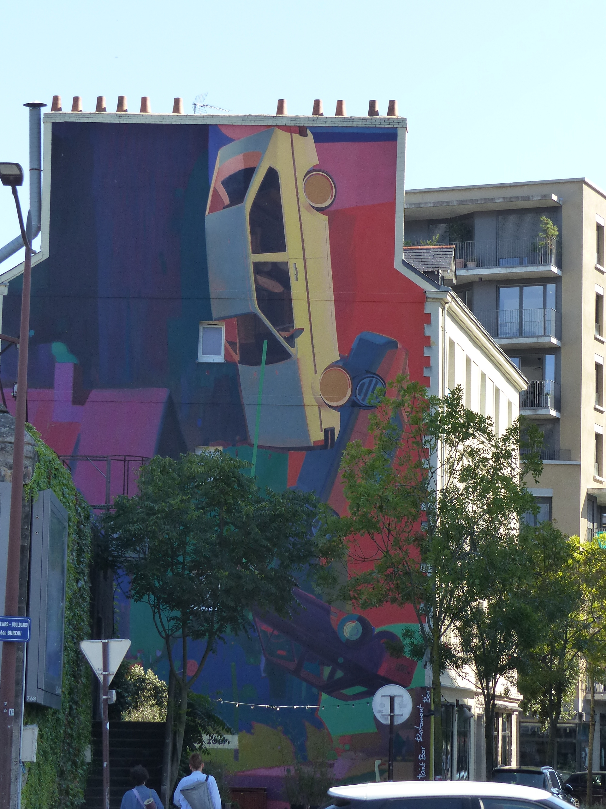
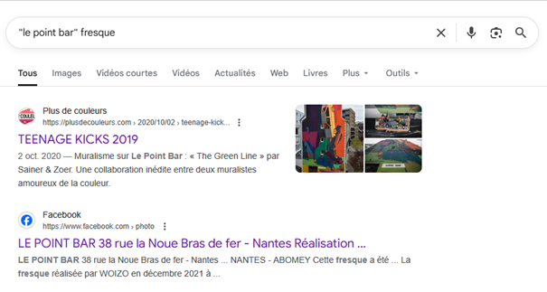
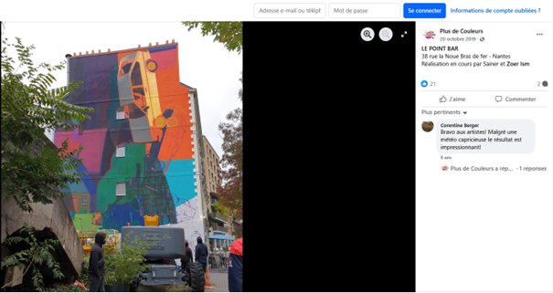
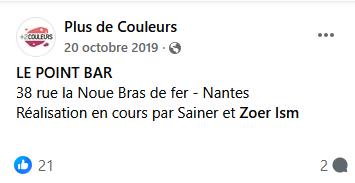
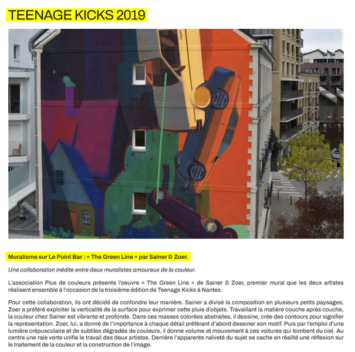
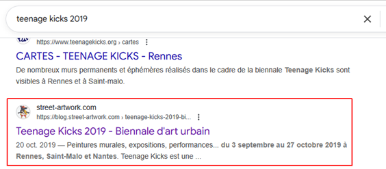
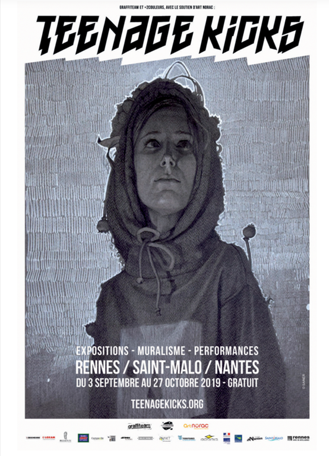

# Challenge
Fresque murale

## Enonce
En marchant dans la rue, tu rencontres cette fresque murale. Elle a été peinte par deux artistes lors d’un événement. Ton bracelet temporel te permettrait de remonter à l'événement, mais tu dois d'abord trouver des informations : les noms des deux artistes à l’origine de cette fresque et la date à laquelle l'événement s’est terminé.
Note : un des artistes a un nom d'artiste en deux mots, le nom le plus courant est à utiliser.

exemple : ENI{artiste1_artiste2_01-12-2025}

## Solution
En examinant la photo, nous pouvons voir deux informations intéressantes : un panneau de rue en bas à gauche (boulevard Léon Bureau) et une enseigne plus à droite (Point Bar Restaurant Bar).
Une recherche sur "boulevard Léon bureau fresque" permet de trouver des fresques à Nantes, des informations sur Le Mur nantes, mais rien sur notre fresque. Avec les mots-clés "le point bar fresque", nous avons des résultats plus intéressants.

Regardons les deux premiers liens. Nous tombons sur une publication Facebook du Point Bar à Nantes du 20/10/2019, montrant la fresque en question. Nous avons également le nom des artistes : Sainer et Zoer Ism (cet artiste est plus souvent nommé Zoer, nous retiendrons donc cette dénomination).

L'autre lien nous apprend qu'elle a été peinte à l'occasion du Teenage kicks 2019.

Intéressons-nous maintenant aux dates de l’événement. En recherchant les termes "teenage kicks 2019", nous retrouvons l’affiche (https://blog.street-artwork.com/fr/teenage-kicks-2019-biennal-street-art-show/), qui nous indique que l’événement s’est déroulé du 03/09 au 27/10/2019, soit 7 jours après la publication du Point Bar.

Le flag attendu est donc ENI{sainer_zoer_27-10-2019}.

## Hints
