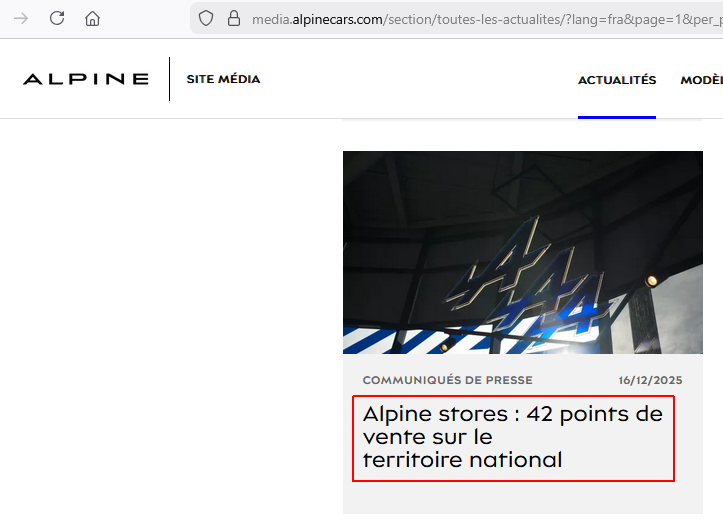
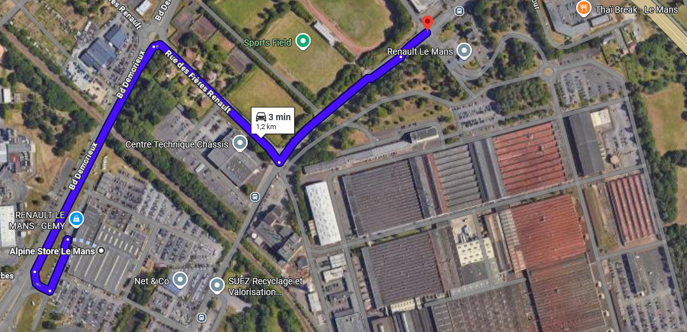
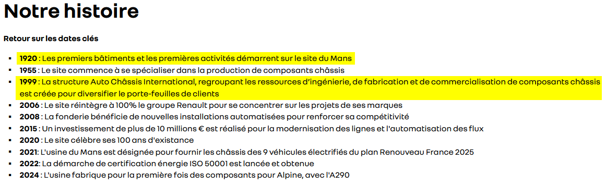
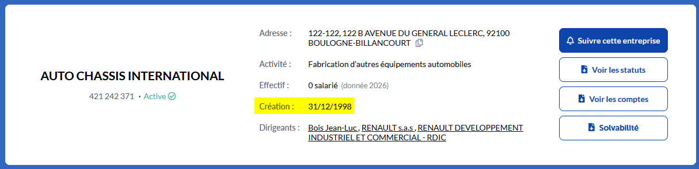

# Challenge
Investigations automobiles (1/2)

## Enonce
A proximité de ce concessionnaire multimarque se trouve une usine de l'une des marques vendues ici. Cette usine est devenue une société à part entière. En quelle année a été créée cette usine et à quelle date l'entreprise a-t'elle été créée ?

exemple : ENI{1893_25071975}

## Solution
L'énoncé présente la photo d'un concessionnaire multimarque : Dacia, Renault et Alpine. Une recherche inversée sur l'image ne donne aucun résultat. Les plaques d'immatriculation des voitures permettent de voir que la photo a été prise en France. Les concessions Renault et Dacia y sont nombreuses , mais Alpine n'a "que" 42 concessions au 16/12/2025. L'information se trouve sur le site média d'Alpine (https://media.alpinecars.com/), dans les actualités.

Le site officiel Alpine comporte une rubrique "Notre réseau", permettant de voir les concessionnaires Alpine. Il n'y a toutefois aucune liste et la recherche n'affiche que les 10 concessions les plus proches du lieu indiqué. Aucune liste complète (ni même partielle proche des 42) n'est trouvable facilement. Deux solutions possibles :
    - Faire plusieurs recherches sur la carte pour établir la liste des concessions
    - Rechercher "Alpine Store" sur Google Maps pour obtenir une liste partielle (par chance, la concession de la photo est dans la liste)

Une alternative permet toutefois de réduire le temps de recherche. La devanture présente la mention d'une société : Gemy Automobiles. En recherchant dans un moteur de recherche, nous pouvons déterminé qu'il s'agit d'un groupe de concessions automobiles présent sur le centre-ouest principalement. Le site du groupe présente la liste des concessions (https://www.gemy.fr/concessions). Il y est possible de filtrer par marque, et le groupe ne possède qu'une concession Alpine, au Mans.

En comparant la photo avec la vue Google Street View ou des photos des concessions, nous pouvons confirmer qu'il s'agit de la même concession. En regardant sur Google Maps, nous pouvons voir l'usine Renault Le Mans tout proche.

Recherchons plus d'informations sur un moteur de recherche. Nous trouvons une page sur le site officiel de Renault Group (https://www.renaultgroup.com/groupe/implantations/usine-le-mans-aci/), qui nous donne déjà des informations : l'usine est une société à part, filiale à 100% de Renault SAS, son année de création (1920), ainsi qu'un historique. Nous y apprenons aussi que l'usine est devenue la société Auto Châssis International en 1999 (nous pouvons d'ailleurs voir dans les photos associées à l'usine sur Google Maps un panneau Auto Chassis International). La page Wikipedia de l'usine (https://fr.wikipedia.org/wiki/Usine_Renault_ACI_du_Mans) nous donne les mêmes informations.

Pour connaître la date exacte de création de la société, allons sur Pappers (https://www.pappers.fr/entreprise/auto-chassis-international-421242371). L'information est également trouvable sur L'annuaire des entreprises (site de l'Etat Français - https://annuaire-entreprises.data.gouv.fr/entreprise/auto-chassis-international-421242371). La date de création de la société est le 31/12/1998.

Le flag attendu est donc ENI{1920_31121998}.

## Hints
- "L'une des marques a moins de concessions que les autres."
