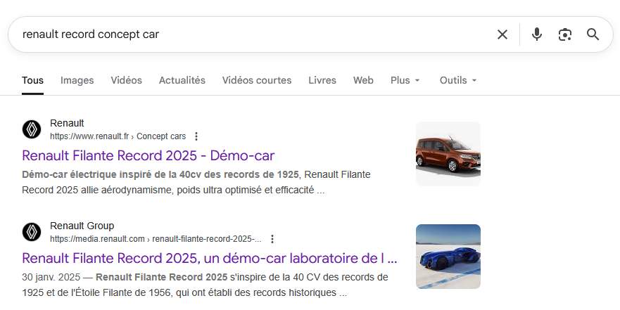
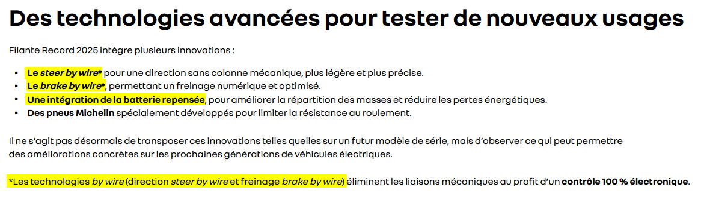
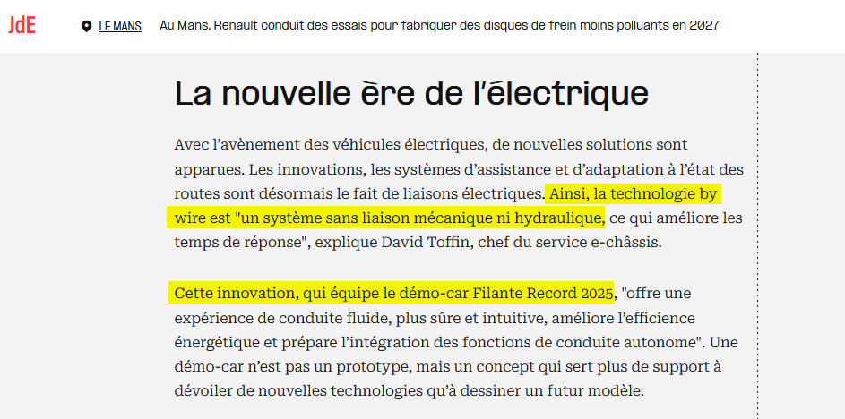
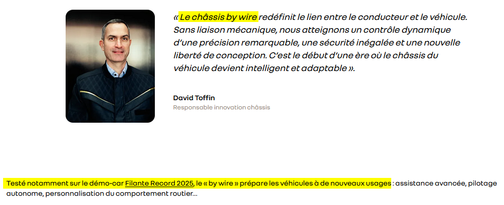

# Challenge
Investigations automobiles (2/2) : futur

## Enonce
Récemment, un record a été battu par un concept-car, destiné à tester les technologies des véhicules du futur. Des innovations utilisées sur ce véhicule ont été conçues dans cette usine. Quel est le nom de la technologie regroupant ces innovations ? Quel est le nom **complet** du concept-car ?

exemple : ENI{nom-technologie_citroen-cxperience-concept-2016}

## Solution
En faisant une recherche avec les termes "renault record concept car", nous trouvons plusieurs articles traitant du concept-car Renault Filante, qui a battu un record en 2025.

Nous trouvons notamment un article sur le site média de Renault (https://media.renault.com/renault-filante-record-2025-un-demo-car-laboratoire-de-lefficience-electrique/?lang=fra) dédié à ce concept-car. Il mentionne plusieurs technologies intégrées dans ce modèle : steer by wire, brake by wire, cell-to-pack, des pneus Michelin spécifiques. Cette page sur le site Renault Group (https://www.renaultgroup.com/magazine/nos-actualites-groupe/efficience-energetique-au-top-avec-filante-record-2025/) donne également ces informations.

Nous pouvons essayer d'affiner la recherche avec les mots-clés "renault filante 2025 le mans". Nous trouvons un lien instagram mentionnant le concept-car. La page contient une vidéo traitant du site manceau de Renault (https://www.instagram.com/reel/DRSboGJE04W/). Elle mentionne plusieurs innovations conçues sur le site : le boîtier Apache (lié à l'acoustique), Chassis by wire (lié à la direction). Les termes "renault le mans innovation" nous permettent de trouver cet article du Journal des entreprises (https://www.lejournaldesentreprises.com/article/au-mans-renault-conduit-des-essais-pour-fabriquer-des-disques-de-frein-moins-polluants-en-2027-2131462) dédié aux innovations récentes issues de cette usine. Hormis un nouveau process de fabrication des disques de freins, il est mentionné la technologie "by wire" (mention également utilisée sur la page du site Renault Group mentionnée précédemment). Cet article trouvé avec les mêmes termes de recherche mentionne également les innovations "by wire" et les lie directement au concept-car (https://www.renaultgroup.com/magazine/technologie/voyage-au-centre-des-innovations-chassis-du-groupe/). Nous avons donc confirmation de la technologie recherchée et de son nom : by wire, regroupant les innovations "brake by wire" et "steer by wire".

Le flag attendu est donc ENI{by-wire_renault-filante-record-2025}.

## Hints
