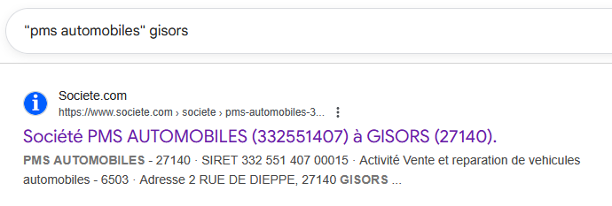
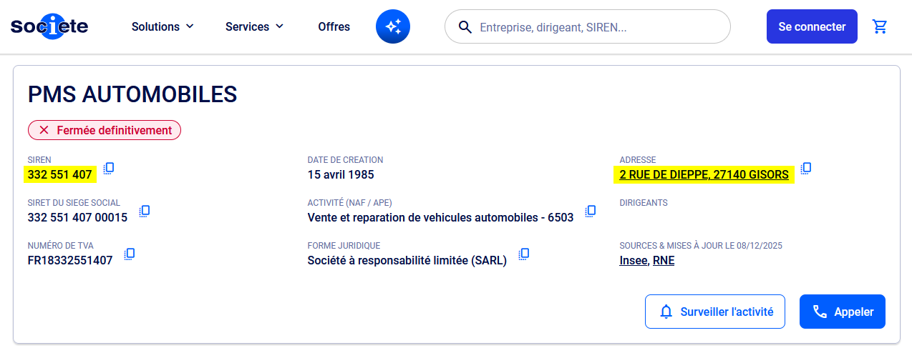
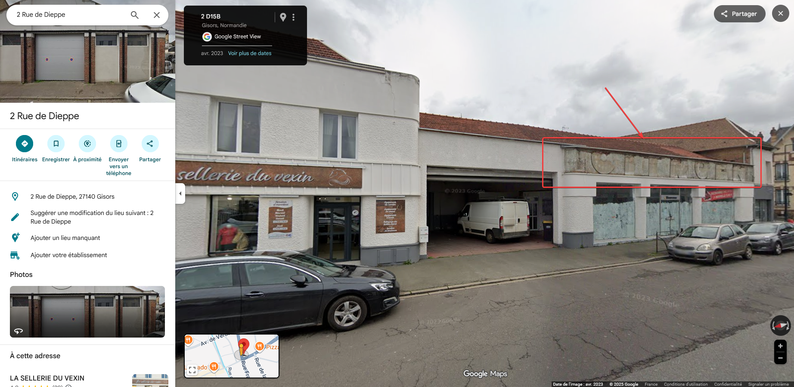
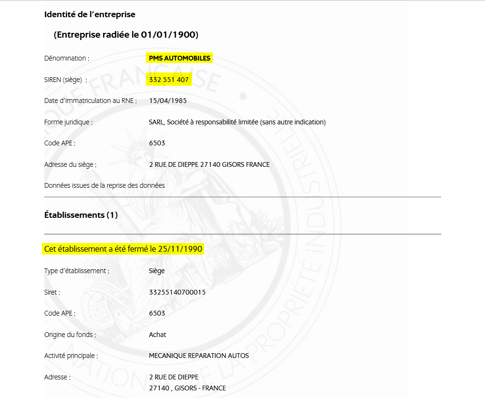

# Challenge
Garage disparu

## Enonce
Lors d'une sortie, tu tombes sur cette vieille voiture abandonnée. Fan d'exploration, tu t'intéresses à son histoire et aimerais voir le garage avant sa fermeture grâce à ton bracelet temporel. Trouve le numéro SIREN de cette entreprise et l'année de fermeture du garage.

exemple : ENI{123456789_1980}

## Solution
La photo laisse apparaître le nom de l'entreprise et sa ville : PMS Automobiles à Gisors.
En recherchant dans un moteur de recherche ("pms automobiles" gisors), nous trouvons un lien vers societe.com (les guillemets dans la recherche permettent de spécifier une chaîne de caractères complète à trouver).

Nous trouvons en haut de la page quelques informations, dont le numéro SIREN et l'adresse à Gisors.

Si nous cherchons l'adresse sur Google Street View, nous pouvons voir l'ancienne enseigne CITROEN sur la façade, confirmant sa présence.

L'entreprise ayant fermé il y a longtemps, peu d'informations sont présentes. Les dates présentes dans la rubrique Informations légales sont les dates par défaut. Si on clique sur Extrait RNE, nous trouvons la date de fermeture du garage situé à cette adresse : le 25 novembre 1990.

Le site de l'INPI donne les mêmes informations : https://data.inpi.fr/entreprises/332551407?q=332551407#332551407

Le flag est donc ENI{332551407_1990}.

## Hints
