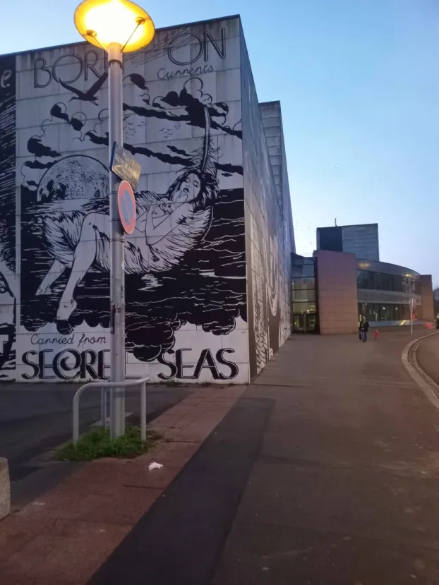
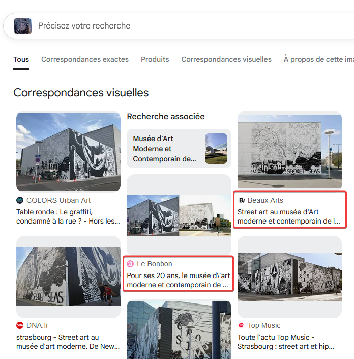
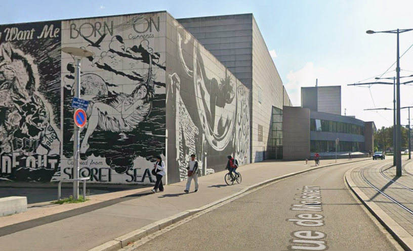
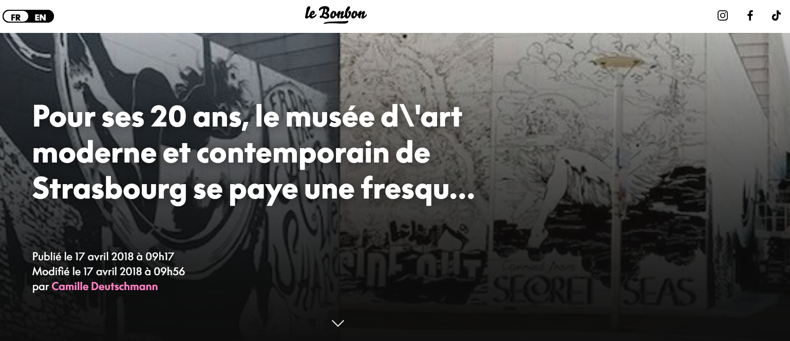
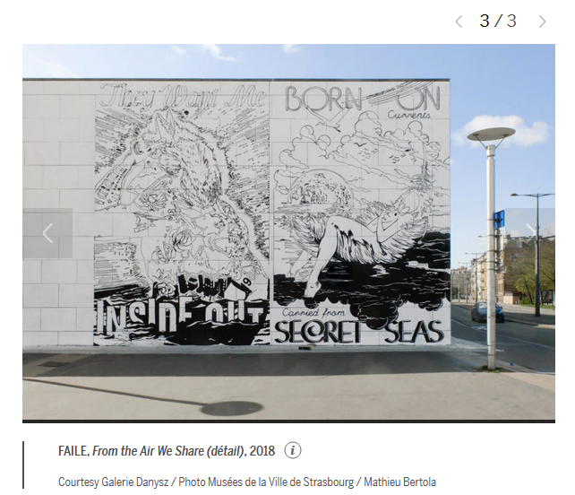
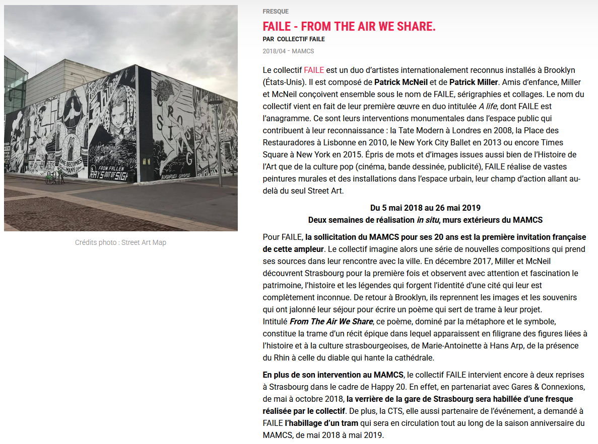

# Challenge
Urban Comic (1/2)

## Enonce
En marchant dans la rue, tu rencontres cette fresque, peinte pour un anniversaire.  Ton bracelet temporel te permettra de remonter le temps jusqu'à l'événement, mais tu dois d'abord trouver des informations : en quelle année a t'elle été peinte et par quel groupe d'artistes ?

exemple : ENI{1999_BAILEY}

## Solution
L'analyse de la photo nous permet de déterminer les éléments suivants :
- Un bâtiment moderne, sur lequel est peinte une fresque
- Un lampadaire portant un panneau de stationnement interdit et une plaque de rue qui n'est pas assez lisible pour donner des informations.

Commençons par faire une recherche à partir de la photo sur Google Images ou un moteur similaire. Nous trouvons plusieurs résultats intéressants. Le bâtiment est le musée d'art moderne et contemporain de Strasbourg. Nous pouvons confirmer l'information sur Google Street View sur la place Hans Jean-Harp / 5 rue de Molsheim.

Deux sites vont nous fournir des informations utiles : Le Bonbon (https://www.lebonbon.fr/strasbourg/news/pour-ses-20-ans-le-musee-d-art-moderne-et-contemporain-de-strasbourg-se-paye-une-fresque-de-folie/) et Beaux Arts (https://www.beauxarts.com/vu/le-street-art-de-faile-envahit-strasbourg/).

Le premier nous révèle que la fresque a été peinte pour les 20 ans du musée en 2018. Il mentionne également plusieurs noms d'artistes, sans pour autant pouvoir confirmer celui à l'origine de cette fresque. Le second (Beaux Arts) nous confirme l'occasion : les 20 ans du musée. Il nous indique également le collectif d'artistes à l'origine de cette fresque : FAILE. Il nous donne également des informations sur l'oeuvre : il s'agit d'une série de fresques constituant un poème sur la ville, intitulé From the Air We Share. Le site Streetmap.eu en lien en bas de la page (https://strasbourg.streetartmap.eu/oeuvres/faile-from-the-air-we-share/) nous confirme l'information. Cette page du site du musée confirme également toutes les informations (https://www.musees.strasbourg.eu/edition/-/entity/id/2845154).

Le flag est donc ENI{2018_FAILE}.

## Hints
