# Challenge
Tempo

## Enonce
Un ami à vous souhaite faire un audit très rapide de son serveur. Il n'a pas beaucoup de budget donc il faudra faire vite pour effectuer cet audit. Jusqu'où serez-vous capable d'aller ?

## Solution
En commençant par le port 873, nous identifions qu'il est possible de se connecter sans authentification.

Il est possible d'identifer le module `pub` qui expose des clés RSA téléchargeables (peut-être pourrons-nous en faire quelque chose !?).

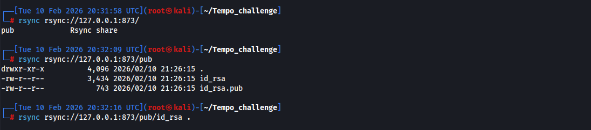

En analysant la clé publique, on observe un nom d'utilisateur: `Jean`.

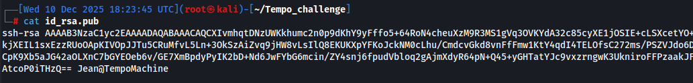

Une tentative d'authentification en utilisant la clé privée avec ce nom d'utilisateur nous informe qu'une `passphrase` est nécessaire.

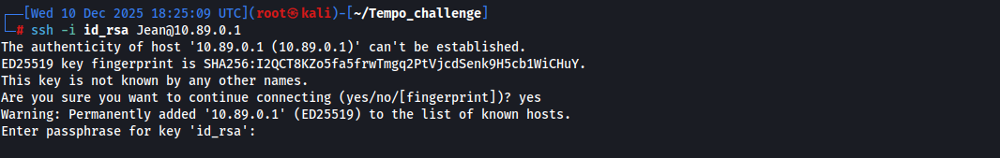

A partir des outils `ssh2john` et `john`, nous sommes en capacité d'identifier rapidement la `passphrase` associé à cette clée privée.

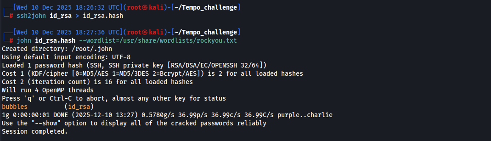

Cette `passphrase` peut ensuite être utilisée pour s'authentifier avec le compte précédemment identifié (`Jean`).

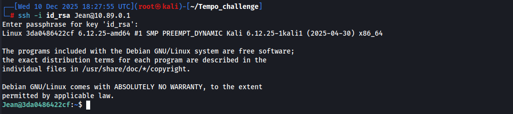

Après exécution de la commande `find / -perm -u=s -type f -exec ls -l {} + 2>/dev/null`, nous observons que le binaire `env` est présent parmi la liste des binaires ayant un SUID configuré.

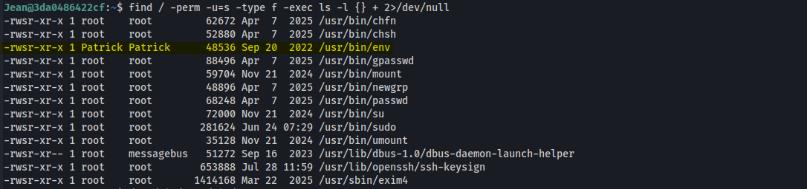

La consultation du site Web https://gtfobins.github.io/gtfobins/env/#suid nous permet de noter qu'une élévation de privilèges est possible sur l'utilisateur propriétaire de ce binaire(`Patrick` dans le cas présent).

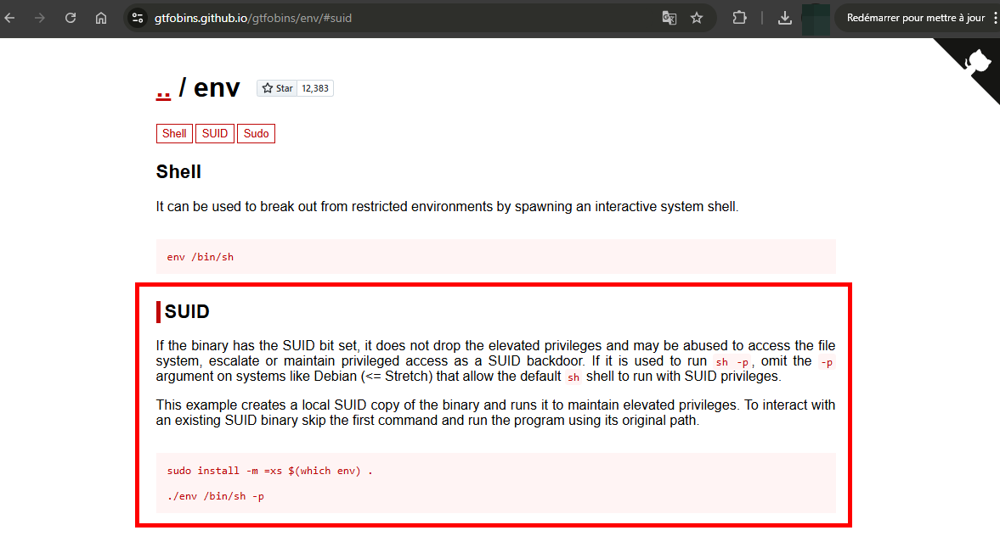

Exploitation:

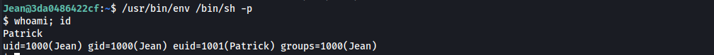

Avec les droits de l'utilisateur `Patrick` nous pouvons réitérer notre énumération jusqu'à identifier un contenu intéressant au sein du `.bash_history` présent dans le répertoire de l'utilisateur.

Parmi ces données, un mot de passe utilisé pour s'authentifier localement au compte `Danny` via le protocole SSH.

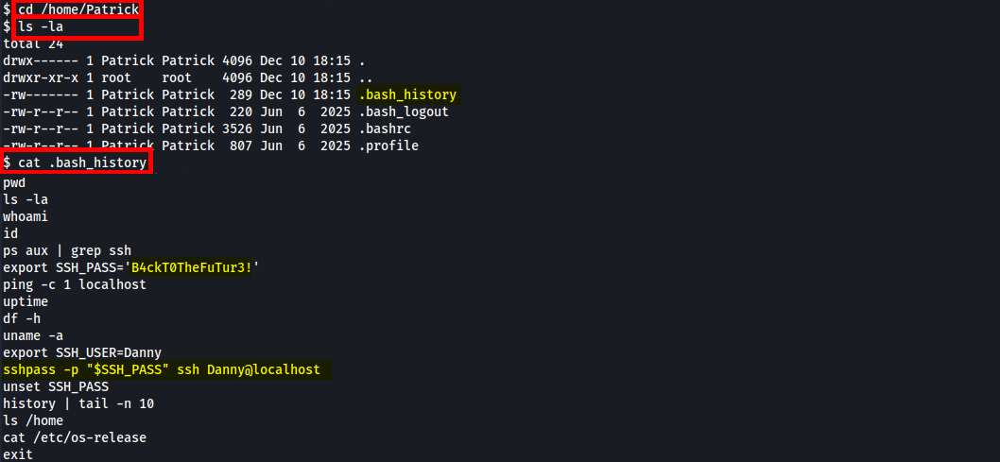

En exploitant ce couple identifiant / mot de passe, nous parvenons à prendre le contrôle de l'utilisateur `Danny`.

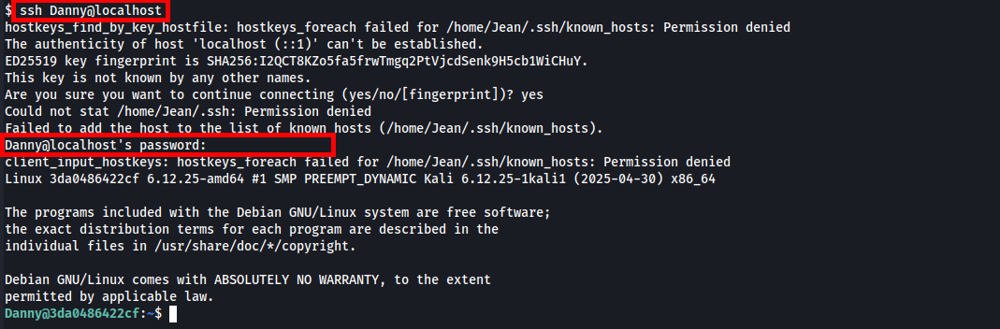

Au sein du répertoire personnel de ce nouvel utilisateur, nous observons la présence d'un binaire nommé `super-find`. Ce binaire présente également un SUID, et est la propriété de l'utilisateur `root`.

Son exécution permet d'afficher l'ensemble des fichiers modifiés au cours des 24 dernières heures au sein de l'ensemble des répertoires personnels (`/home/`)

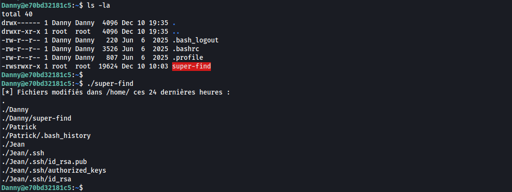

Après analyse de ce binaire, nous pouvons observer que la commande utilisée est `find . -mtime -1`. De plus, il y a une subtilité: le binaire `find` n'est pas appelé par son chemin absolu `/usr/etc/find`.

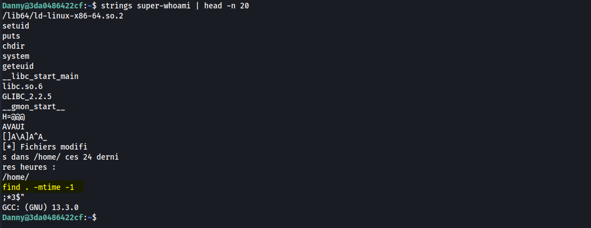

Comme nous pouvons le voir ci-dessous il est possible de manipuler le binaire qui sera appelé lors de l'exécution en altérant la variable d'environnement `PATH`.

Dans le scénario démontré, nous créons un script bash qui permettra d’effectuer notre élévation de privilèges à destination de l'utilisateur `root`.

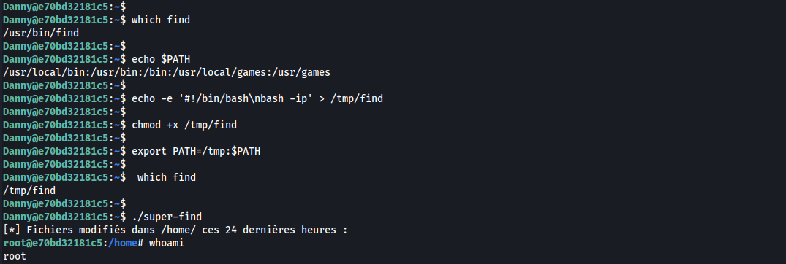

Il est alors possible d'obtenir le flag, situé à la racine de la machine :)

## Hints
- (to Jean) brute-force de la clé RSA
- (Jean to Patrick) Il y a des binaires avec des SUID intéressants ?
- (Patrick to Danny) Tu as bien regardé le répertoire personnel de l'utilisateur ?
- (Danny to root) Regarde bien le binaire et la façon dont sont exécutées les actions (outils -> strings).
