# Challenge
Grave_QL

## Enonce
Un portail interne vient d’être déployé. L’authentification semble correcte… en apparence.

## Solution
Sans surprise, la page principale du challenge est une page d'authentification.

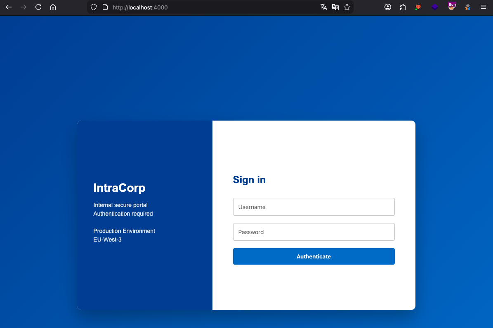

Nous pouvons observer que l'authentification se fait via une requête GraphQL. De plus, le mot de passe semble chiffré avant d'être envoyé au serveur.

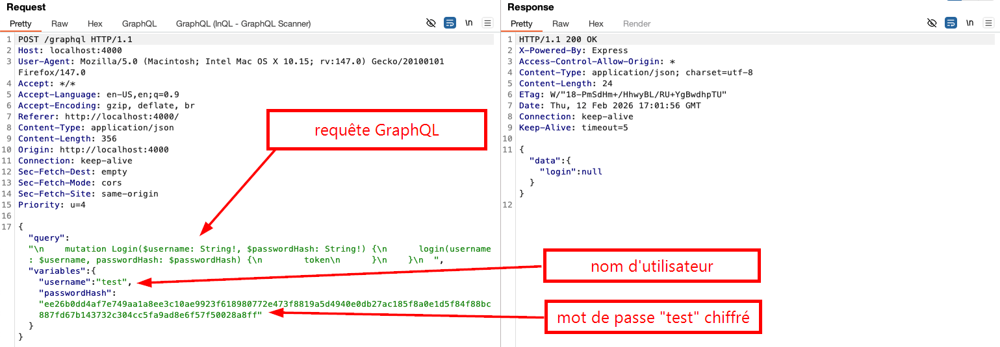

En inspectant la page d'authentification, nous pouvons voir que l'algorithme SHA-512 est utilisé pour cette étape de chiffrement du mot de passe.

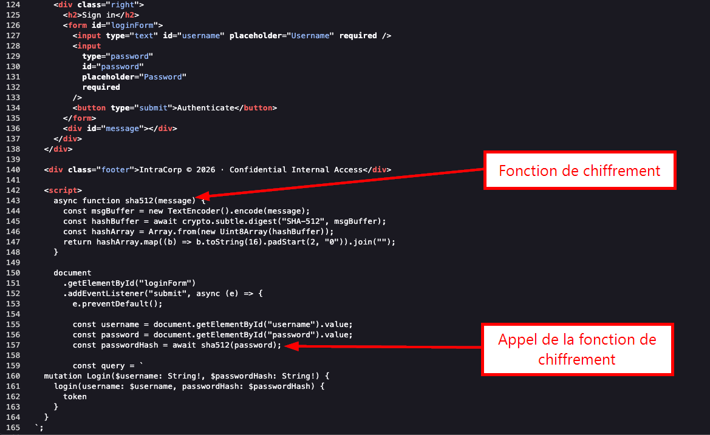

Nous pouvons utiliser l'extension BurpSuite nommée `InQL` pour tenter d'identifier des `queries` valides, que nous pourrons ensuite tenter d'exploiter.

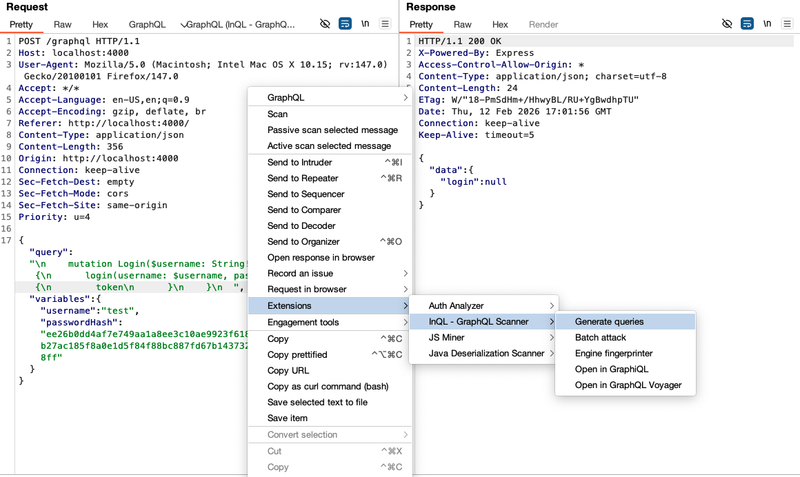

Après l'execution de l'outil, nous obtenons 5 `Queries`et 1 `Mutation`. Interessant !

Nous pouvons par exemple voir ci-dessous que la Query `users` permet d'obtenir un certain nombre d'informations sur l'ensemble des utilisateurs (email, id, profil, role, etc).

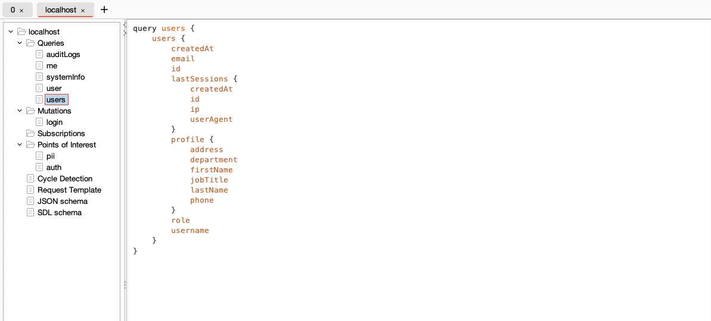

Nous pouvons également observer la présence d'une Query `user` qui permet d'obtenir un résultat sensiblement similaire à la Query `users`, pour un utilisateur défini (via le filtre `id`), au détail près que cette Query permettra de récupérer une donnée nommée `passwordHash`. Très interressant !.

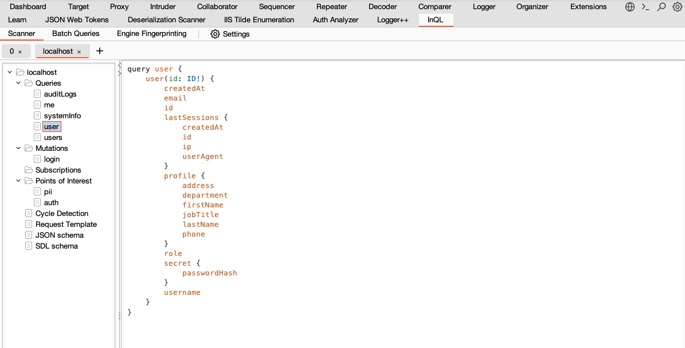

En réutilisant le format de requête proposé par InQL pour la Query users, nous pouvons obtenir les numéros d'id de l'ensemble des utilisateurs, ainsi que d'autres informations associées:

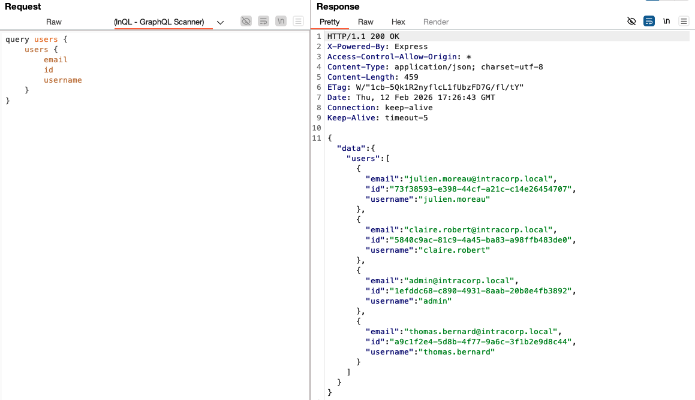

Nous voyons que nous avons 4 utilisateurs.

Pour récupérer le mot de passe, nous pouvons procéder de 2 manières.

La première consiste à effectuer 1 requête pour chaque numéro d'id d'utilisateur et demande à récupérer le mot de passe de l'utilisateur associé:

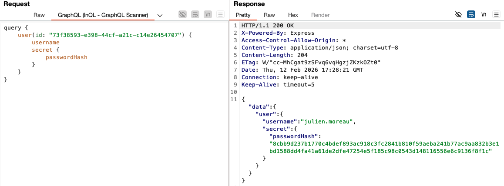

La seconde méthode permet d'effectuer 1 seule requete avec plusieurs sous-requête GrapQL :

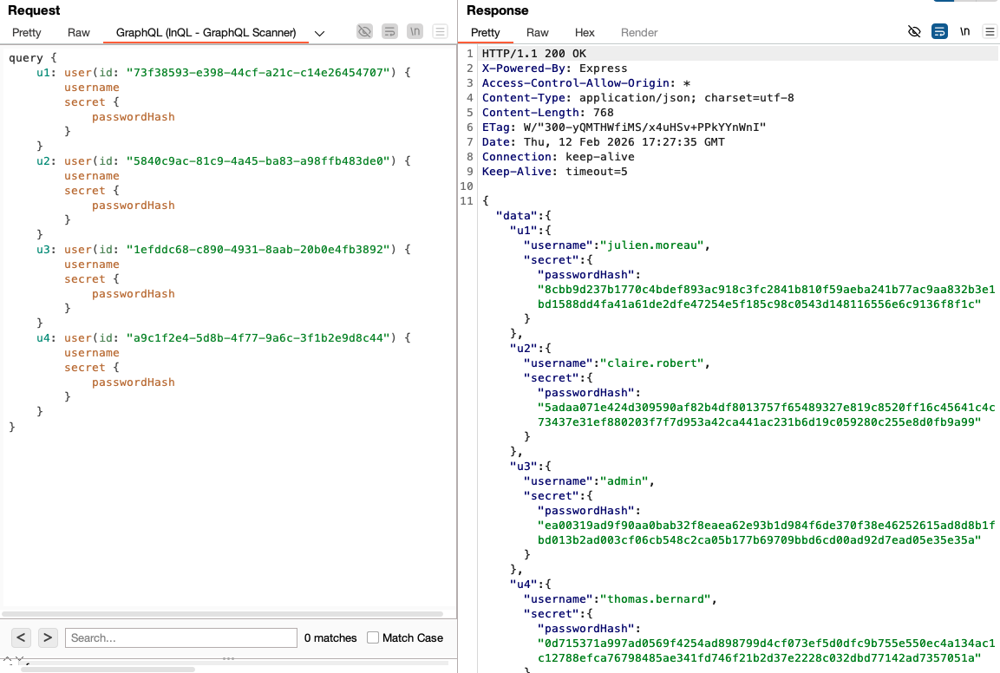

Avec ces mots de passe (hashés avec l'algorithme SHA-512), nous pouvons tenter de nous authentifier sur chacun de ces comptes.
Pour ce faire, et parce qu'on ne connait pas le mot de passe utilisé, et qu'aucune attaque par brute-force n'est nécessaire ici, nous pouvons utiliser BurpSuite en mode interception pour manipuler le contenu des requêtes d'authentification afin d'usurper l'identité d'un autre utilisateur.

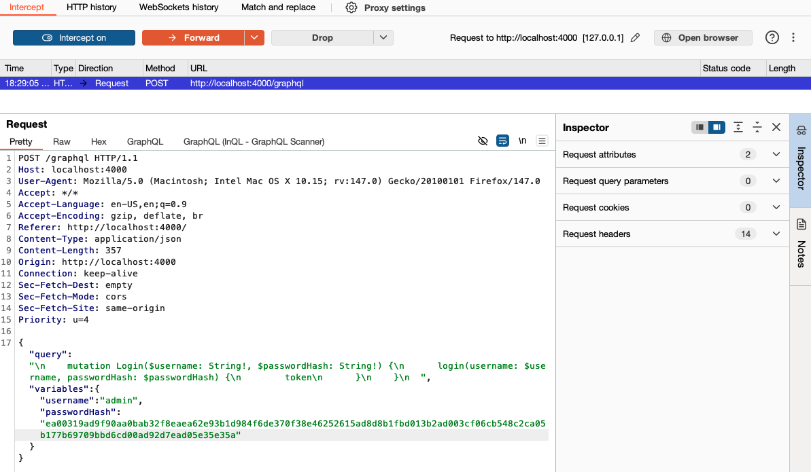

Après s'être authentifié avec l'utilisateur `admin`, nous sommes redirigé vers la page `/dashboard.html` avec les informations personnelles de l'utilisateur, dont le flag :

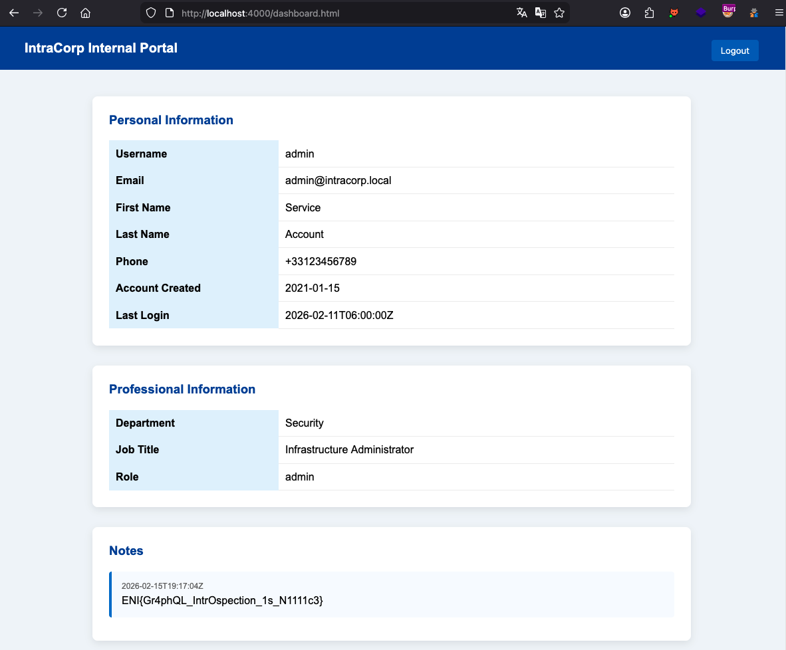

## Hints
- Tu connais GraphQL ?
- Quelles sont les vulnérabilités les plus communes ?
- Tu as pu identifier les utilisateurs ?
- Tu as pu récupérer les données `passwordHash` des utilisateurs ?
