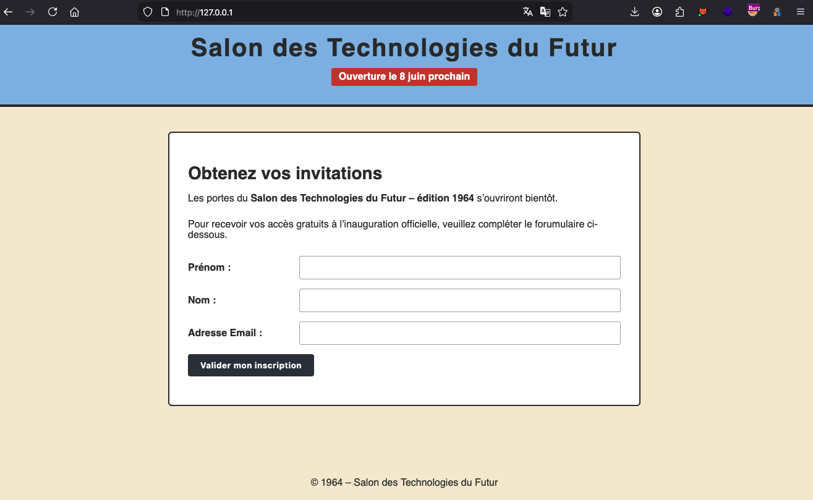
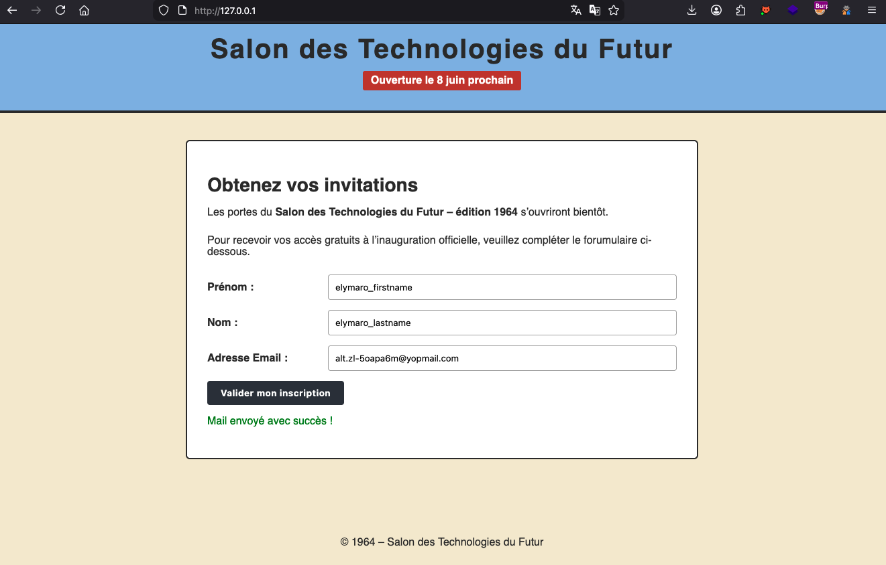
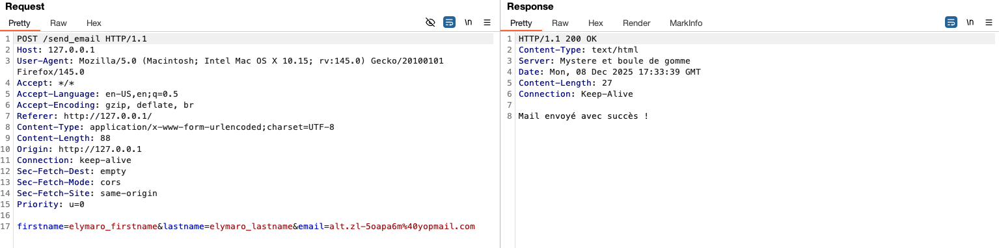
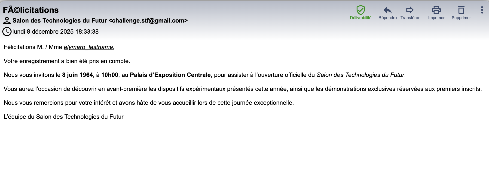
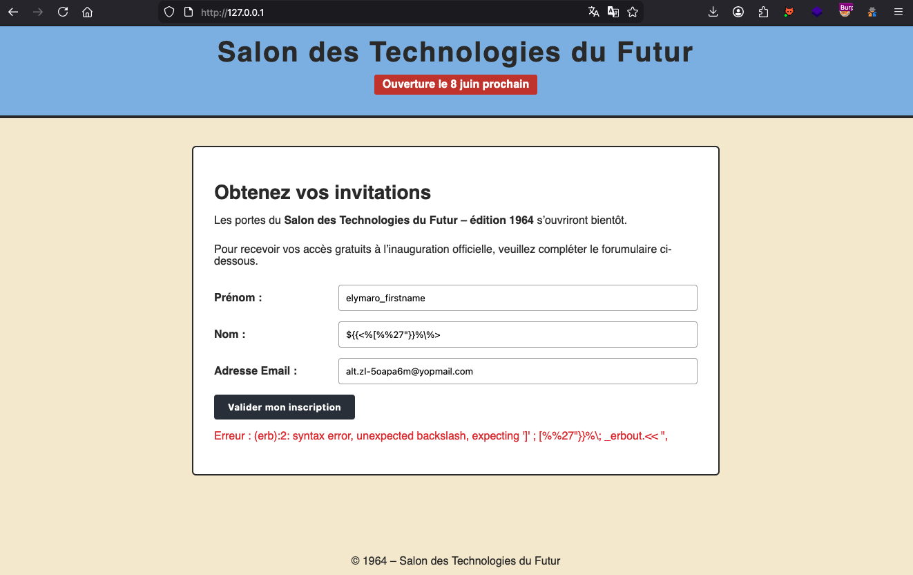
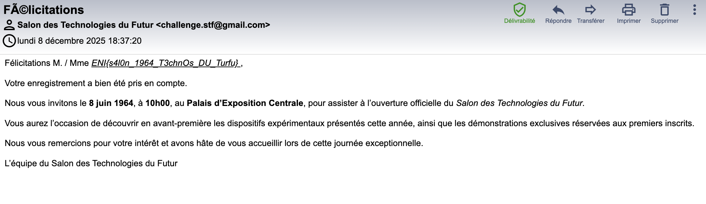

# Challenge
STF

## Enonce
Nous sommes en 1864. Un nouveau salon d'un nouveau genre ouvre ses portes dans quelques mois pour présenter les technologies que l'on a des chances de voir apparaîtres dans les années 2000 (voitures volantes, robots, etc). Inscrivez-vous vite, les places sont limitées !

Ouvrez vos yeux à la racine de toute chose :)

## Solution
Sur l'application Web, seul une fonctionnalité d'envoi de mail est disponible. Il est demandé de fournir un prénom, un nom, ainsi que l'adresse mail de contact.

Après avoir saisi nos informations, un message indique qu'un mail nous a été transmis :

Ci-dessous la requête Burp permettant d'observer les données transmises, ainsi que la réponse du serveur :

En contrôlant notre boite mail, nous pouvons constater que nous avons reçu une invitation pour le `Salon des Technologies du Futur`. Nous pouvons observer que parmi les informations fournies le nom de famille est retourné dans le contenu du mail.

Parmi les possibilités de vulnérabilité dans ce genre de contexte, nous pouvons penser aux exploitations de vulnérabilité par injection SQL, HTML, ou encore de moteur de template (SSTI). Pour cette dernière, une charge de detection telle que la suivante peut être utilisée : `${{<%[%%27"}}%\%>` (voir le cours [PortSwigger](https://portswigger.net/web-security/server-side-template-injection#constructing-a-server-side-template-injection-attack) pour plus d'infos). On peut observer que le serveur retourne un message d'erreur dont la chaîne de caractère `erb` (qui est un moteur de template Ruby).

Les tentatives d'exploitation de ce type de vulnérabilité permettent de mettre en évidence la vulnérabilité, puis le contenu du flag:

## Hints
- Avez-vous besoin d'être SSTIMULÉ ?
- Regarder du coté des 'moteurs de template'
