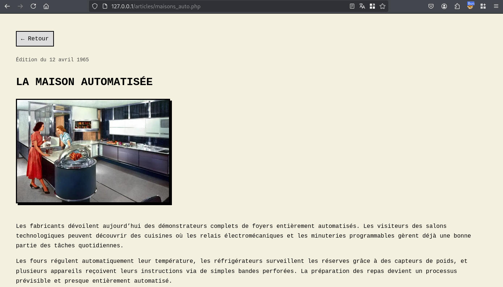
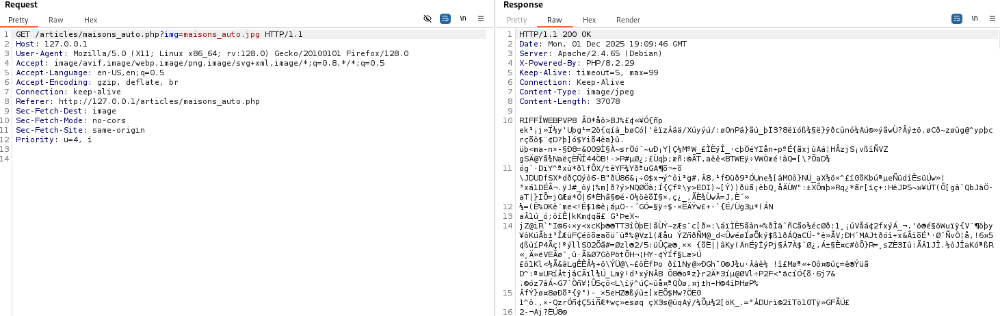
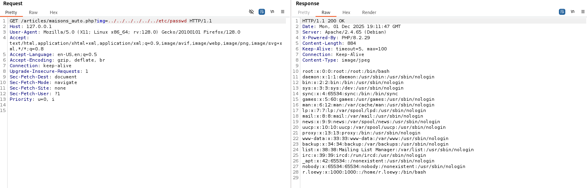
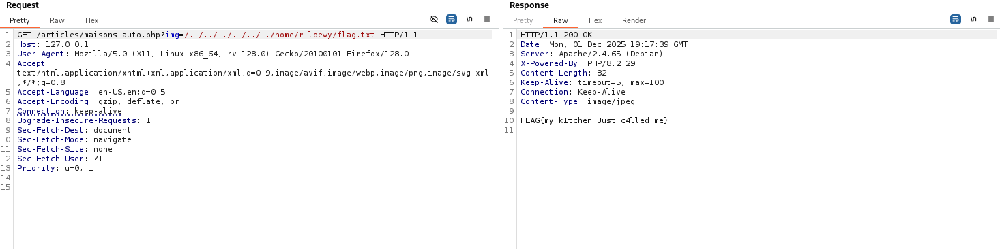

# Challenge
Années 60

# Enonce

L'administrateur de ce site rétro a essayé de bien faire les choses… mais malheureusement une vulnérabilité béante est présente. Vous devriez trouver un petit cadeau au sein de son répertoire utilisateur.

# Solution
Sur la page principale, 3 articles sont présentés :

Après avoir cliqué sur un article, nous pouvons observer qu’une requête avec un paramètre `img` est effectuée à destination du serveur pour récupérer une image.

En effectuant des tests relatifs aux attaques de type `Path Traversal`, nous pouvons observer que nous pouvons lire des fichiers arbitraires sur le serveur web.

L’énoncé nous demandait de récupérer le flag dans l’unique répertoire utilisateur. À l'étape précédente, il a été possible de récupérer le compte `r.loewy`, donc nous rechercherons le flag au chemin suivant : `/home/r.loewy/flag.txt`.

# Hints
- La pelle des images
