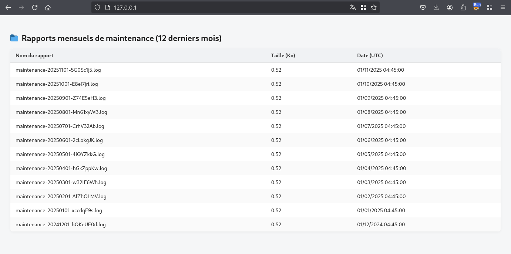
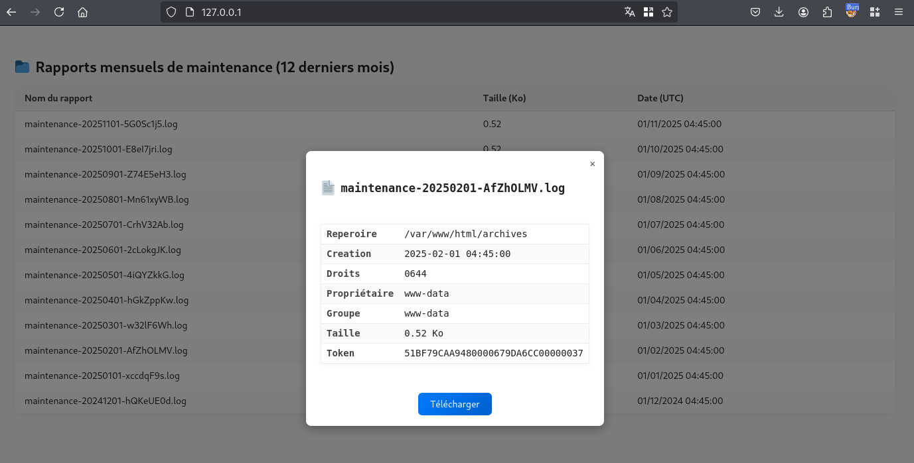
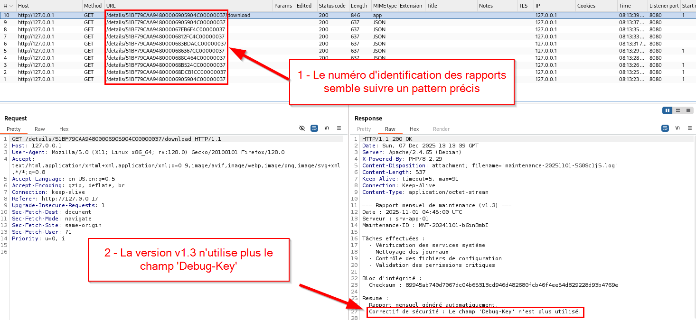
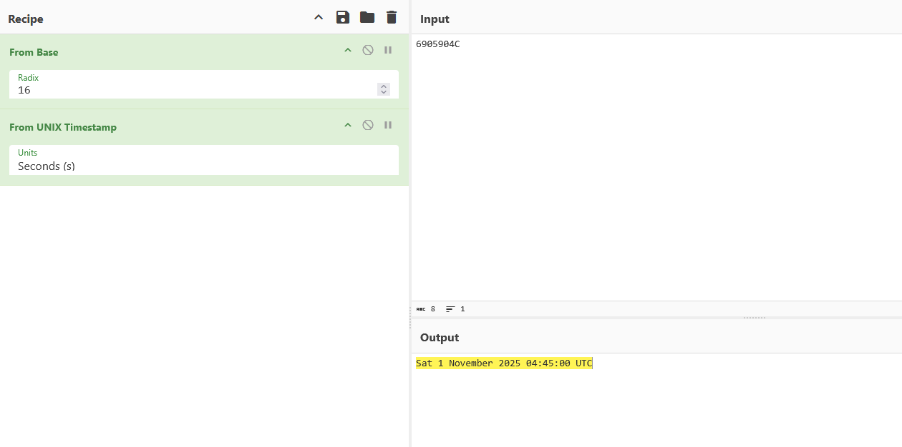
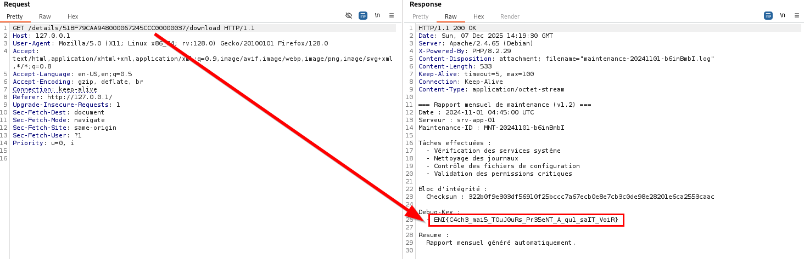

# Challenge
Back-Up

# Enonce
Des rapports de maintenance sont automatiquement générés. Heureusement, depuis la version 1.3 de cette tâche, aucune information sensible ne fuite au sein du contenu.

# Solution
Lorsque l'on arrive sur la page principale du challenge, nous pouvons observer les 12 derniers rapports de maintenance :

Lorsque l'on clique sur un rapport, un certain nombre d'informations techniques sont retournées.

Pour chacun de ces rapports, une fonctionnalité de téléchargement est disponible.

Pour accéder au détails d'un rapport et le télécharger, le serveur attend un numéro d'identification, nommé `token`.

Après avoir cliqué sur plusieurs rapports, on peut observer que les numéros d'identification suivent un pattern précis.

Pour l'exemple du `token` 51BF79CAA94800006905904C00000037 :
Un préfixe constant  : 51BF79CAA9480000
Une valeur dynamique : 6905904C
Un suffixe constant  : 00000037

Il est également observé que cette valeur dynamique est toujours au format hexadécimal.
Avec un outil tel que CyberChef, nous pouvons convertir cette valeur en base 10 (décimale).
6905904C -> 1761972300

Un œil averti reconnaît ici qu'il s'agit d'un timestamp UNIX, que l'on peut ensuite convertir en date UTC :
1761972300 -> Sun 1 November 2025 04:45:00 UTC

Nous savons désormais que la valeur dynamique est le format hexadécimal du timestamp de création du rapport.

Pour chacun des rapports, il est possible d'observer qu'il est généré chaque 1ᵉʳ jour du mois, à 04h45 UTC.

Nous avons également eu l'information qu'une donnée sensible était divulguée dans la version 1.2 de cette tâche.

Il est alors nécessaire de retrouver la valeur des précédents rapports, non visibles au sein de cette interface Web.

Dans l'exemple présenté ici, le dernier rapport affiché date du 2024-12-01 04:45:00, il nous faut donc trouver les rapports du 2024-11-01 04:45:00, ou plus ancien.

La conversion de cette date donne ceci : (date -> timestamp UTC -> hexa)
2024-11-01 04:45:00 -> 1730436300 -> 67245CCC

Avec cette information, il est alors possible d'obtenir le flag :

# hints:
- Token
- pattern
