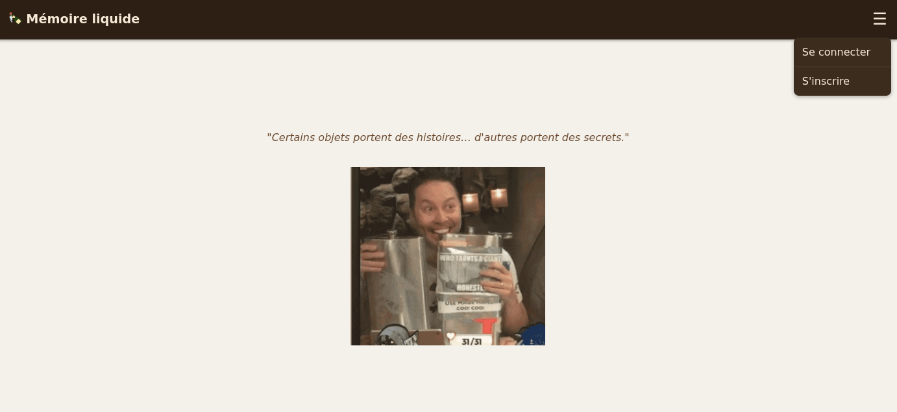
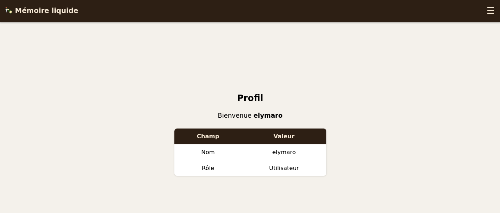
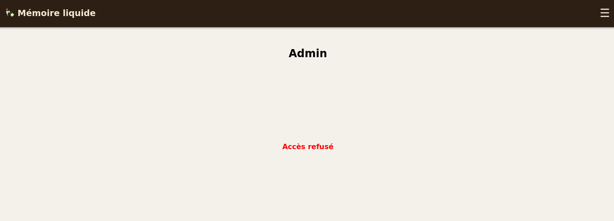
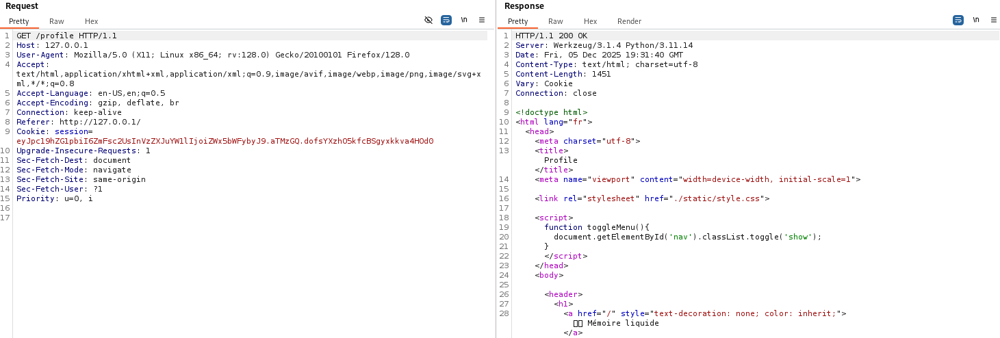
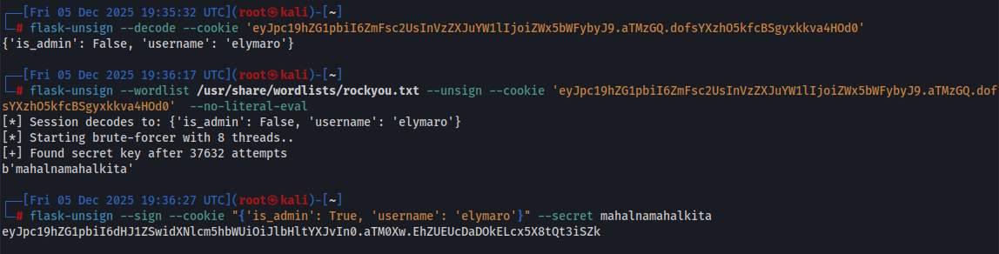
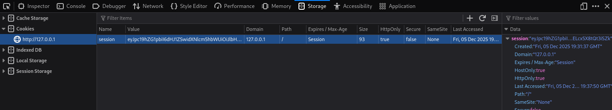
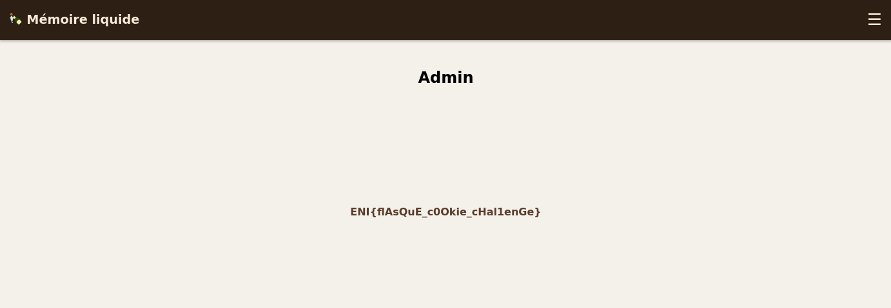

# Challenge
Mémoire liquide

# Enonce
Jacky garde toujours une vieille flask dont il refuse de se séparer. Certains disent que ceux qui en comprendront vraiment l’histoire pourront remonter le temps… et en découvrir un secret.

# Solution
Lorsque l'on arrive sur la page principale du challenge, 2 fonctionnalités sont disponibles :
- S'inscrire
- Se connecter

Après s'être créé un compte (`/register`) et s'être authentifié (`/login`), il est possible de découvrir 2 nouvelles fonctionnalités.
La première est la fonctionnalité de profil (`/profile`)

Et la seconde est la fonctionnalité d'admin (`/admin`)

Nous pouvons constater que le compte ne disposent pas des droits suffisants pour accéder au contenu de cette page.

Après analyse des requêtes Burp, nous pouvons observer que le serveur retourne un entête `Server: Werkzeug/3.1.4 Python/3.11.14`.

De plus, nous pouvons noter qu'un cookie nommé `session` a été fourni par le serveur à notre utilisateur.

Les cookies Flask sont signés avec la librairie `itsdangerous`, qui peuvent être brufe-forcés si le secret n'est pas suffisamment robuste.

So, let's do it !

Top, nous avons réussi à identifier le secret qui a permis de signer le cookie. Nous avons réussi à en altérer le contenu, nous allons désormais tenter de l'utiliser.

Pour ce faire, soit nous pouvons modifier notre cookie de session au sein de notre navigateur, soit dans notre proxy (tel que Burp).

Après rafraîchissement de la page `/admin` nous obtenons le flag.

# hints:
- Tu as pensé à regarder le cookie ?
- Tu as regardé le Framework utilisé du serveur ?
